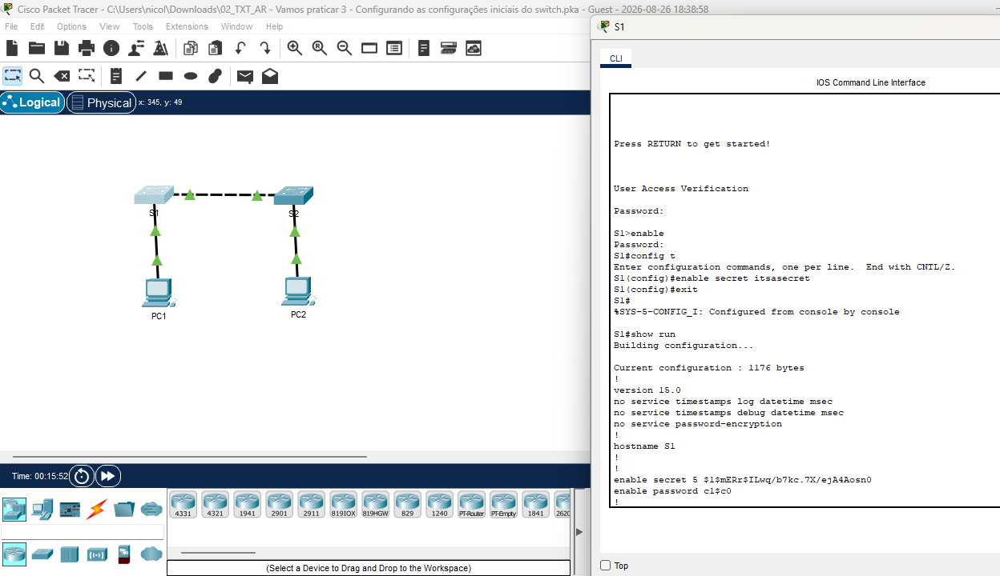

# 🔒 Configuração Inicial e Criptografia de Senhas em Switches Cisco

Este repositório contém uma tarefa acadêmica prática desenvolvida no **Cisco Packet Tracer**. O objetivo principal do projeto é aplicar configurações iniciais de segurança em equipamentos de rede, especificamente a configuração e criptografia de senhas utilizando a Interface de Linha de Comando (CLI) do Cisco IOS.

## 🗺️ Topolog
ia da Rede e Execução



> **Nota:** A imagem acima ilustra a topologia utilizada (2 Switches e 2 PCs) e o terminal do Switch 1 (S1) exibindo a configuração da senha secreta e a verificação no arquivo de configuração em execução (`running-config`).

## 🎯 Objetivos do Laboratório
Nesta tarefa da faculdade, foram executados e validados os seguintes requisitos de segurança:
* Acesso aos modos de operação do Cisco IOS (Modo Usuário, Privilegiado e Configuração Global).
* Configuração do nome do dispositivo (`hostname S1`).
* Configuração de senha de acesso simples (`enable password`).
* Configuração de senha forte e criptografada para o modo privilegiado (`enable secret`).
* Validação da criptografia de senhas através da leitura do arquivo de configuração (`show running-config`).

## 🛠️ Tecnologias e Dispositivos Utilizados
* **Simulador:** Cisco Packet Tracer
* **Sistema Operacional:** Cisco IOS (CLI)
* **Dispositivos na Topologia:** 
  * 2x Switches Cisco (S1 e S2)
  * 2x Computadores (PC1 e PC2)

## ⚙️ Principais Comandos Utilizados (CLI)
Abaixo estão os comandos chaves executados no terminal para garantir a segurança de acesso ao equipamento:

```bash
S1> enable
S1# configure terminal
S1(config)# enable secret itsasecret
S1(config)# exit
S1# show running-config
